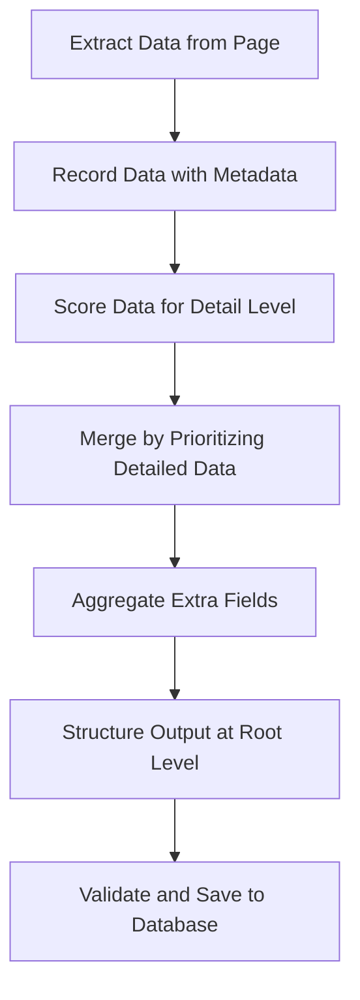

# PDF Processing Improvement Plan

This document outlines the plan to enhance the PDF processing and data merging logic in `pdf_processor_alt.py` for sensor datasheets, addressing issues with "Unknown" values in specifications and aligning the output structure with user requirements.

## 1. Extraction Enhancement
- **Objective**: Improve the accuracy and completeness of data extracted from each page.
- **Actions**:
  - Modify the extraction prompt (lines 129-157 in `pdf_processor_alt.py`) to explicitly instruct the LLM to avoid using "Unknown" as a placeholder unless no data is found. Encourage partial data extraction with a note on confidence if applicable.
  - Include a broader range of fields or keywords in the prompt to capture more nuanced data, especially for `specifications` subcategories (performance, electrical, mechanical, environmental).
  - Limit the text input per page to avoid token overflow, but ensure key sections are prioritized (e.g., first 8000 characters as currently done, but consider summarizing or chunking if necessary).

## 2. Recording Improvement
- **Objective**: Retain all extracted data with additional metadata for better merging decisions.
- **Actions**:
  - For each page's extracted data, add metadata fields such as `page_number`, `extraction_confidence` (if provided by the LLM or inferred from data completeness), and `text_snippet` (a short excerpt of the source text for reference).
  - Store raw extracted JSON from each page in the database with these metadata fields to allow for future re-merging or debugging (already partially implemented in lines 275-287).

## 3. Merging Logic Revision
- **Objective**: Develop a more intelligent merging strategy to prioritize detailed data and avoid "Unknown" values.
- **Actions**:
  - Revise the `merge_extracted_data` function (lines 422-512) to implement a scoring system for field values based on detail level (e.g., length of string, presence of units, numerical values) rather than just prioritizing later pages.
  - For `specifications` subcategories, merge nested dictionaries by retaining the most detailed value for each key. If multiple values exist, consider creating a list of values with page references for manual review or further processing.
  - Aggregate `extra_fields` by combining data from all pages into a single dictionary, using unique keys or lists to prevent data loss (e.g., if two pages have different `extra_fields` for the same key, store as a list).
  - Remove initialization of fields with `None` or empty dictionaries unless no data is found across all pages. Instead, build the structure dynamically based on extracted data.

## 4. Output Structure Adjustment
- **Objective**: Align the final output with the user's desired format where fields are at the root level.
- **Actions**:
  - Modify the data structuring in `process_pdf_datasheet_alt` (around lines 262-266) to place `sensor_type`, `manufacturer`, `model`, `specifications`, `extra_fields`, and `source` directly under the root of the `structured_data` dictionary, rather than nesting under a model-specific key within `sensor_specifications`.
  - Ensure the database storage reflects this structure by updating the `sensor_specifications` collection insert operation (line 291 in `pdf_processor.py` for reference) to store data in the correct format.

## 5. Validation and Logging
- **Objective**: Add checks to validate data completeness and improve debugging.
- **Actions**:
  - After merging, log a summary of filled versus missing fields in `specifications` to identify extraction gaps (enhance logging around line 248 in `pdf_processor_alt.py`).
  - Implement a validation step before saving to the database to ensure no critical fields are "Unknown" unless explicitly extracted as such from the text. If critical fields are missing, trigger a secondary extraction attempt with a different prompt or model settings.

## Visual Representation of Merging Process
Below is a Mermaid diagram illustrating the improved merging process flow:

## Implementation Notes
This plan will be implemented in the `pdf_processor_alt.py` file, focusing on improving the quality of merged output by ensuring detailed data is retained and structured correctly. The next step will be to switch to a mode suitable for code implementation to apply these changes.