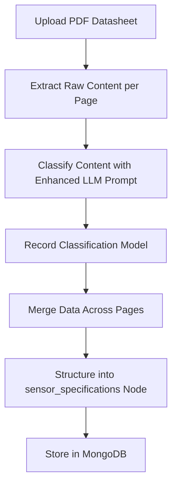

# Sensor Datasheet Specification Processing Plan

## Goals
1. Extract raw content from each page of sensor datasheets.
2. Classify the extracted information into five categories: performance, electrical, mechanical, environmental, and additional.
3. Note which model was used to classify the information for each page.
4. Combine all specifications into a single node under "sensor_specifications" with the sensor name (model) as the ID.

## Steps to Accomplish the Task

1. **Enhance PDF Extraction Process**:
   - Modify the `process_pdf_datasheet` function in `backend/services/pdf_processor.py` to include the model name used for extraction in the metadata of each processed page.
   - Ensure that the extraction prompt and logic continue to categorize data into performance, electrical, mechanical, environmental, and additional (via `extra_fields`).

2. **Develop a Detailed LLM Prompt**:
   - Create a well-structured prompt for the LLM that includes:
     - **Specific Instructions**: Clearly define the task of extracting and classifying sensor datasheet information into the specified categories.
     - **Desired Tone and Style**: Use a formal, technical tone suitable for precise data extraction.
     - **Background Information**: Provide context about the sensor type (if inferable from filename) and the importance of accuracy in datasheet processing.
     - **Constraints and Goals**: Limit extraction to relevant fields, ensure values are exact with units, and set fields to null if uncertain. The goal is to produce structured JSON output.
     - **Addressing Ambiguities**: Include instructions to handle unclear data by setting values to null if not 100% certain, and to capture additional important information in an "extra_fields" object.
   - Update the existing prompt in `pdf_processor.py` (lines 147-172) with this enhanced version to improve extraction accuracy.

3. **Store Classification Model Information**:
   - Add a field in the `page_document` dictionary (used when storing data to MongoDB) to record the `extraction_model` name for each page's extracted data.

4. **Merge and Structure Data**:
   - Enhance the `merge_extracted_data` function to include a record of which model was used for classification in the merged output.
   - Create a new function or modify the existing storage logic to format the final merged data into a "sensor_specifications" node, using the sensor's model name as the ID.

5. **Database Storage**:
   - Update the MongoDB storage process to save the final structured data under a "sensor_specifications" collection or node, ensuring the ID is the sensor model name.
   - Ensure that the raw page data and classification model information are preserved for reference.

## Proposed Data Structure
The final combined specification will be stored in a structure like this:

```json
{
  "sensor_specifications": {
    "<sensor_model_name>": {
      "sensor_type": "<type>",
      "manufacturer": "<manufacturer>",
      "model": "<model>",
      "specifications": {
        "performance": { ... },
        "electrical": { ... },
        "mechanical": { ... },
        "environmental": { ... }
      },
      "additional": { ... }, // from extra_fields
      "classification_model": "<model_name_used_for_extraction>",
      "source": {
        "filename": "<original_filename>",
        "upload_date": "<date>",
        "page_count": <number>
      }
    }
  }
}
```

## Proposed LLM Prompt Structure
Below is an outline of the enhanced prompt to be used in the extraction process:

```
You are a specialized AI for extracting structured data from sensor datasheets. Your task is to analyze the provided text from a sensor datasheet and extract key information into a well-structured JSON format with high accuracy.

**Instructions**:
- Extract ONLY the following information, setting fields to null if not found in the text:
  - sensor_type: The type of sensor (e.g., "Temperature Sensor", "Pressure Sensor")
  - manufacturer: The company that makes the sensor
  - model: The specific model number or name of the sensor
  - specifications: An object containing these nested objects:
    - performance: Include fields like sensitivity, range, accuracy, resolution, response_time
    - electrical: Include fields like power_supply, current_consumption, output_type, interface
    - mechanical: Include fields like dimensions, weight, mounting_options, package_type
    - environmental: Include fields like operating_temp, storage_temp, humidity_range, protection_rating
- For each field, include the exact value FROM THE TEXT, with units if specified.
- If you're not 100% sure about a value, set it to null to avoid incorrect data.
- If you find additional important information that doesn't fit the schema, include it in an "extra_fields" object.

**Context**:
- Sensor model from filename appears to be: {model_hint}
- This may be a {sensor_type_hint} based on the filename.
- Accuracy is critical as this data will be used for technical reference and decision-making.

**Constraints**:
- Respond ONLY with a valid JSON object containing the extracted information.
- Do not include any explanations, notes, or additional text outside the JSON structure.

Text from page {page_num} of {total_pages}:
{page_text}
```

## Mermaid Diagram for Process Flow


## Implementation Notes
- The existing code in `pdf_processor.py` already handles extraction and classification well, so modifications will focus on metadata addition, prompt enhancement, and final structuring.
- A new or updated function will be needed to wrap the merged data into the "sensor_specifications" node format before storage.
- Ensure that the frontend or any other part of the application can access this structured data for display or further processing.